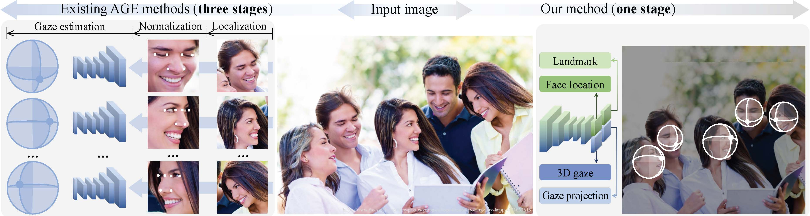
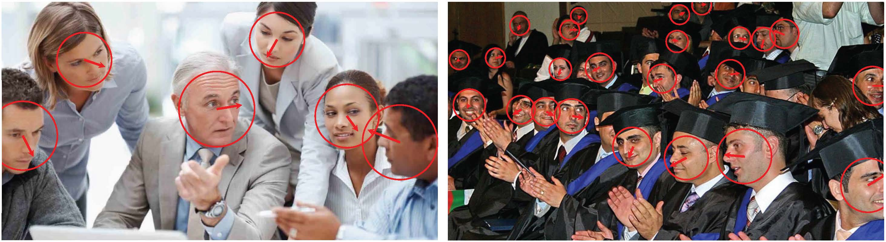

# GazeOnce
(CVPR2022) GazeOnce: Real-Time Multi-Person Gaze Estimation

[Paper](http://arxiv.org/abs/2204.09480)

## Dataset

To download the MPSGaze dataset, please register here https://forms.gle/1L1fdgQBPAeosJRe8. Thank you!

(We will send you a link to download as soon as the data is prepared and your request is reviewed)

The MPSGaze dataset is a synthetic dataset containing full images (instead of only cropped faces) that provides ground truth 3D gaze directions for multiple people in one image.

## Method

We propose the first one-stage end-to-end gaze estimation method, GazeOnce, which is capable of simultaneously predicting gaze directions for multiple faces (>10) in an image. The overview of our method and an example of our output are shown below.





## Citation

```
@inproceedings{zhang2022gazeonce,
  title={GazeOnce: Real-Time Multi-Person Gaze Estimation},
  author={Zhang, Mingfang and Liu, Yunfei and Lu, Feng},
  booktitle={Proceedings of the IEEE/CVF Conference on Computer Vision and Pattern Recognition},
  pages={1--10},
  year={2022}
}
```
